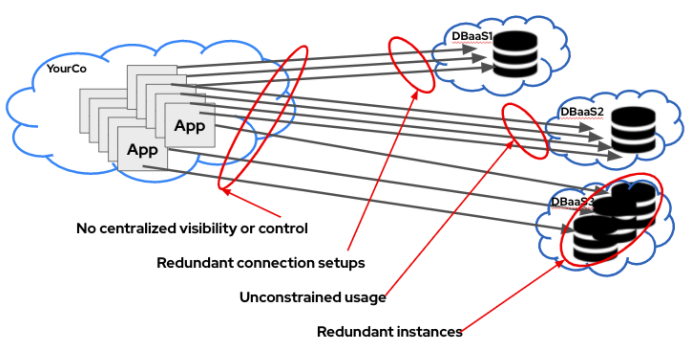

## Simplifying Managed Database Access on OpenShift
March 4, 2022 | Will McGrath & Veda Shankar

#### **Introduction**

The introduction of containers and container orchestration has made it easier to deploy and update applications.  The growing popularity of database cloud service offerings has also simplified the development and deployment of stateful cloud native applications.  But developers often access these database services in many different ways, dealing with a myriad of security credentials, which the developer often gets from their IT counterparts. Credentials are often shared ad-hoc where developers end up setting up DBaaS connections manually which can be time-consuming and error-prone. In organizations where many development teams are building and deploying diverse applications across a large container estate, it is inefficient and risky to have each team independently connect applications to different DBaaS offerings.

For the cluster administrators, the proliferation of instances and types of database cloud services makes it difficult for them to get a consolidated view of the consumption by different users.

**Challenges for ad hoc DBaaS in the Enterprise**

>>>>>  gd2md-html alert: inline image link here (to images/image1.png). Store image on your image server and adjust path/filename/extension if necessary.  (<a href="#">Back to top</a>)(<a href="#gdcalert2">Next alert</a>) >>>>> 

Red Hat has developed a new add-on service, Red Hat OpenShift Database Access, that makes it easier for administrators to provision and manage access to multiple 3rd party database services. OpenShift Database Access also helps developers to connect their applications to database services with a consistent and predictable experience, without bothering administrators and needing to learn the nuances of database service provider’s access requirements.

**Solution: Red Hat OpenShift Database Access (RHODA)**

* Faster and easier self-service for developers
* More efficient connection, DB utilization
* Centralized monitoring, consistent control plane for admins

>>>>>  gd2md-html alert: inline image link here (to images/image2.png). Store image on your image server and adjust path/filename/extension if necessary.  (<a href="#">Back to top</a>)(<a href="#gdcalert3">Next alert</a>) >>>>> 

Red Hat OpenShift Database Access is available on two OpenShift cloud services - OpenShift Dedicated  and OpenShift Service on AWS.  Initially, it supports three database vendor offerings - MongoDB Atlas, a popular cloud database service, Crunchy Data’s Crunchy Bridge which provides a managed PostgreSQL cloud service, and CockroachDB Dedicated, a distributed SQL database service.

**High Level Architecture of OpenShift Database Access**

>>>>>  gd2md-html alert: inline image link here (to images/image3.png). Store image on your image server and adjust path/filename/extension if necessary.  (<a href="#">Back to top</a>)(<a href="#gdcalert4">Next alert</a>) >>>>> 

#### **Installing Red Hat OpenShift Database Access on Managed OpenShift Cluster**

OpenShift Database Access can be installed on an existing OpenShift cloud service cluster on AWS and is available as a Service Preview for **FREE**!  Let’s show you how.

Log into the **Red Hat Hybrid Cloud Console** and go to the **Add-ons** section in your OpenShift cluster and select the **Red Hat OpenShift Database Access** tile. Refer to the [Quick Start Guide](https://access.redhat.com/documentation/en-us/red_hat_openshift_database_access/1/html-single/quick_start_guide/index) for detailed instructions.

#### **Creating Accounts on Managed Database Services**

As a first step you need to create an account with the database provider. The following links will guide you through the account creation for each of the supported database partners:

* [MongoDB Atlas](https://www.mongodb.com/atlas/database)
* [Crunchy Bridge](https://www.crunchybridge.com/signup)
* [CockroachDB Dedicated](https://cockroachlabs.cloud/signup?referralId=web_getstartedcrdb_dedicated_var&_ga=2.114518407.1063113589.1645664180-1611281844.1644887420&_gac=1.229385512.1644887464.EAIaIQobChMIhLaHj8CA9gIVtB-tBh2jYADEEAAYASAAEgIHjfD_BwE)

The appendix section of the [Quick Start Guide](https://access.redhat.com/documentation/en-us/red_hat_openshift_database_access/1/html-single/quick_start_guide/index) has detailed instructions on how to find the managed database service account credentials which will be needed to create the Provider Accounts on RHODA. 

#### **OpenShift Administrator - Create a Database Provider Account**

A Provider Account on RHODA represents an account with a cloud database provider, and you need the authentication credentials for the database account to create it. Using the Cluster Administrator role go to **Data Services** -> **Database Access** on OpenShift’s left-hand navigation menu. Also, you need to select the **openshift-dbass-operator** namespace in order to create the provider account. Initially, there are no provider accounts and you will need to create one using the **Create -> Database Provider Account** option. Use the Create Provider Account form to assign a unique name to the provider account and select the database provider from the drop down menu and supply the account credentials associated with the provider account. For detailed instructions follow the instructions in the **Creating A Provider Account Resource** section of the [Quick Start Guide](https://access.redhat.com/documentation/en-us/red_hat_openshift_database_access/1/html-single/quick_start_guide/index). 

>>>>>  gd2md-html alert: inline image link here (to images/image4.png). Store image on your image server and adjust path/filename/extension if necessary.  (<a href="#">Back to top</a>)(<a href="#gdcalert5">Next alert</a>) >>>>> 

Once the discovery of the provider platform account is successful, RHODA will discover all the database instances associated with the provider account and add it to the database inventory.

As you add provider accounts and application developers start adding connections to the databases. The database inventory table will get updated and you can see the table with information on what application is connecting to which database instance when you navigate to **Data Services** -> **Database Access**.

>>>>>  gd2md-html alert: inline image link here (to images/image5.png). Store image on your image server and adjust path/filename/extension if necessary.  (<a href="#">Back to top</a>)(<a href="#gdcalert6">Next alert</a>) >>>>> 

#### **OpenShift Administrator - Create a Database Instance**

Once a Provider Account is created, you can create a new database instance by using the **Create -> Database Instance** option in the drop down menu on the OpenShift Database Access status page. You will use the provider account you created for the database provider to create the new instance. The example below shows the creation of a new Mongo Atlas Project under the Organization corresponding to the MongoDB Atlas provider account you created previously.

>>>>>  gd2md-html alert: inline image link here (to images/image6.png). Store image on your image server and adjust path/filename/extension if necessary.  (<a href="#">Back to top</a>)(<a href="#gdcalert7">Next alert</a>) >>>>> 

If successful, you will see that the new database instance has been added to the database inventory table.

**Self-Service for developers** RHODA also lets developers to self-provision a new database instance using an existing provider account. For detailed information refer to the Getting Started For Developers section in the [Quick Start Guide](https://access.redhat.com/documentation/en-us/red_hat_openshift_database_access/1/html-single/quick_start_guide/index).

**NOTE:** Make sure to configure your database provider's IP Access List to allow client connections from your OpenShift cluster otherwise you will encounter a HTTP 504 gateway timeout error. For example, MongoDB Atlas has a separate IP access list that applies to all database deployments in a project. Every time you create a database instance from RHODA, you will create a new project in MongoDB Atlas.

#### OpenShift Developer - Connecting to a Database Instance

Once the Administrator has created the Provider Accounts, the Developer can connect to a database instance to their application workspace. The **Connected Database** category is available on the **Developer Catalog** section which contains the tiles for the different vendors that have been provisioned. 

>>>>>  gd2md-html alert: inline image link here (to images/image7.png). Store image on your image server and adjust path/filename/extension if necessary.  (<a href="#">Back to top</a>)(<a href="#gdcalert8">Next alert</a>) >>>>> 

Adding a database connection to your application namespace creates the Config Map and Secret objects that will allow your application to access the database. Refer to the **Connecting to an External Database Instance** section in the [Quick Start Guide](https://access.redhat.com/documentation/en-us/red_hat_openshift_database_access/1/html-single/quick_start_guide/index) for detailed instructions.

#### OpenShift Developer - Creating a Service Binding to a Database Instance

The Kubernetes Service Binding feature was introduced to bring consistency to the way secrets are shared for connecting applications to external services such as REST APIs, databases, and event buses. OpenShift Database Access leverages the [Kubernetes Service Binding](https://github.com/servicebinding/spec#workload-projection) feature to bring low-touch administrative experience to provision and manage access to external database services. The Service Binding feature enables developers to connect their applications to database services with a consistent and predictable experience.

After connecting to the database instance in the previous step, you should now see the application alongside the database instance in the **Topology** view of your namespace. You can Click and drag the arrow from the application to the database instance to create a service binding connector.

>>>>>  gd2md-html alert: inline image link here (to images/image8.png). Store image on your image server and adjust path/filename/extension if necessary.  (<a href="#">Back to top</a>)(<a href="#gdcalert9">Next alert</a>) >>>>> 

The Service Binding creates a volume on the application POD and organizes the information needed to connect to the database in a directory structure and exposes the volume mount point as an environment variable. Developer frameworks like [Quarkus](https://www.redhat.com/en/topics/cloud-native-apps/what-is-quarkus) are already service binding aware and can automatically connect to the database using this injected workload information without needing to embed database connection information in the source code. The following demo application for [Quarkus MongoDB](https://github.com/RHEcosystemAppEng/mongo-quickstart) and [Quarkus Postgres](https://github.com/RHEcosystemAppEng/postgresql-orm-quickstart) illustrates the use of service binding for connecting to database instances.

We are excited by the vision of Red Hat OpenShift Database Access making it easier than ever for organizations to provide developers with choice and simplicity while enhancing their ability to operate reliably and securely at scale.

To learn more, watch the two demo videos or visit [red.ht/dbaccess](http://red.ht/dbaccess) to try it out. 

* [IT Ops demo video](red.ht/dbaccess_ops_demo)
* [Developer demo video](red.ht/dbaccess_dev_demo)

You can also test the instructions covered in this blog by getting an OpenShift cluster with RHODA pre-installed at the **[Sandbox](https://developers.redhat.com/developer-sandbox/get-started)** website, it's free!
