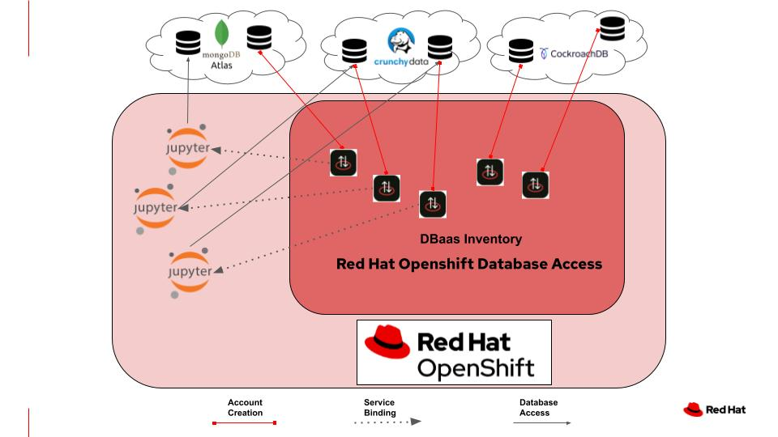

### Red Hat Openshift Database Access (RHODA) Integration with Jupyter Notebook

#### June 20, 2022 | by Michelle DiPalma & Veda Shankar

Integrating Jupyter notebooks with OpenShift cloud services allows data scientists to get started quickly, without having to understand or manage any of the OpenShift infrastructure details. This **[video](https://youtu.be/VRcSZBqw3zc)** demonstrates the service binding between a Jupyter notebook and the Red Hat OpenShift Database Access connection to database cloud services. This allows a notebook user to access database instances without ever leaving their notebook to obtain credentials. The recipe described in this video assumes that the [Kubeflow Notebook Controller](https://www.kubeflow.org/docs/components/notebooks/overview/) has been installed on your OpenShift cluster, and you have a basic working knowledge of [OpenShift](https://developers.redhat.com/learn), [Jupyter Notebooks](https://github.com/jupyterlab/jupyterlab) and [RHODA](https://access.redhat.com/documentation/en-us/red_hat_openshift_database_access/1/html-single/quick_start_guide/index?extIdCarryOver=true&sc_cid=7013a0000030vrlAAA).

For folks wanting to try it on their own, the Jupyter Notebooks referred to in the video are available in the **[rhoda-notebook-controller](https://github.com/RHODA-lab/rhoda-notebook-controller/tree/main/Notebooks)** Github repository. This video is meant as a follow on video to Red Hat OpenShift Database Access admin/developer workflows explained here:

* [IT Ops demo video](http://red.ht/dbaccess_ops_demo)
* [Developer demo video](http://red.ht/dbaccess_dev_demo)

To learn more about OpenShift Data Science you can read the [blog](https://cloud.redhat.com/blog/simplifying-managed-database-access-on-openshift?hs_preview=DvRSqHRp-67568073994) or visit [red.ht/dbaccess](http://red.ht/dbaccess) to try it out.

