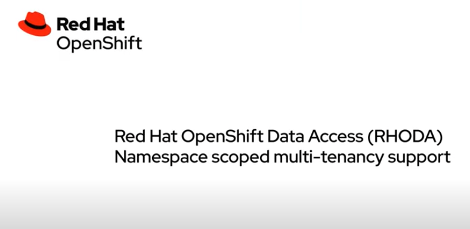

## Namespace access to managed databases from OpenShift

September 26, 2022 | Tommy Hughes, Aron Gunn & Veda Shankar

**tl;dr:** Red Hat OpenShift Database Access (RHODA) improves on the self-service of managed databases by allowing developers to import Database-as-a-Service (DBaaS) Provider Accounts directly into their application namespace without any administrative intervention and share with fellow developers.

This blog explains the new multi-tenancy feature in RHODA, a cloud service that makes it easier to discover, provision, connect and control access to managed databases from Red Hat OpenShift. The tenancy feature is built around native OpenShift rule-based access control and namespaces with a single DBaaS policy per namespace.

After installing the OpenShift Database Access add-on, the RHODA operator creates a new DBaaS policy object in the operator’s installation namespace, typically this namespace is `redhat-dbaas-operator `or` openshift-dbaas-operator`.

Policies are set at the namespace level through the use of a `DBaaSPolicy` object, which then becomes the default policy for any `DBaaSInventory` created in that namespace. This default policy can be overridden on a per-inventory basis.


* `spec.disableProvisions`
    * Disables provisioning in the provider account inventory, defaults to `false`.
* `spec.connectionNamespaces`
    * A list of other namespaces that are allowed a connection to a policy’s inventories. Instead of listing namespaces, you can use an asterisks (‘*’), which allows a connection from all namespaces available in the OpenShift cluster.

The RHODA operator only allows one policy per namespace, and watches for inventory object changes as defined in the policy. The RHODA operator then configures the appropriate access requirements.

Here is the` DBaaSPolicy` object created in the Operator namespace during installation.


```
# by default, all authenticated cluster users can connect/provision against
#   inventory objects in the operator's install namespace. They can do so from
#   any namespace in which they have perms to create DBaaSConnections/Instances.
apiVersion: dbaas.redhat.com/v1alpha1
kind: DBaaSPolicy
metadata:
  name: cluster
  namespace: <operator install namespace>
spec:
  connectionNamespaces:
  - '*'
```


The default policy in the installation namespace allows all authenticated users to have **View** access to any` DBaaSInventory` database instances.

RHODA allows non-admin users, such as developers, to import provider accounts for 3rd party managed database services into their application namespaces provided they have created a DBaaS policy in that namespace. By default, the DBaaS policy restricts access to the database inventories to only the given namespace. A policy’s default values can be overridden on a per-inventory basis. Below is an example of the `DBaaSPolicy` object, with the optional `spec `fields. In this policy example, **User1** shares the provider account inventories in their namespace, `user1-project`, with another namespace,` user2-project` belonging to **User2**.

**Example**


```
apiVersion: dbaas.redhat.com/v1alpha1
kind: DBaaSPolicy
metadata:
  name: user1-policy
  namespace: user1-project
spec:
  connectionNamespaces:
  - user1-project2
  disableProvisions: false
```


As the namespace `user2-project` belongs to **User2**, **User1** also needs to give **View** access to **User2** for the namespace` user1-project`. 

Command: 


```
    oc adm policy add-role-to-user view User2 -n user1-project
```


The` oc adm` step to grant view access is not necessary if a user wants to share the database inventory to other namespaces they own.

The [video](https://youtu.be/IvuBmX1f9ic) below demonstrates the database policy concepts covered in this blog.


To learn more about OpenShift Database Access you can read the [blog](https://cloud.redhat.com/blog/simplifying-managed-database-access-on-openshift?hs_preview=DvRSqHRp-67568073994) or visit [red.ht/dbaccess](http://red.ht/dbaccess) to try it out.

